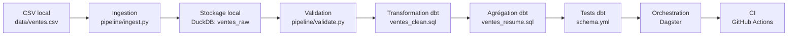

# Schéma simple du pipeline

## Lecture simple du schéma

1. Le fichier `data/ventes.csv` est la donnée de départ.
2. `pipeline/ingest.py` charge le CSV dans DuckDB.
3. La table `ventes_raw` contient les données brutes.
4. `pipeline/validate.py` contrôle les colonnes et les valeurs nulles.
5. dbt crée une table nettoyée `ventes_clean`.
6. dbt crée une table résumée `ventes_resume`.
7. `dbt test` vérifie des contraintes simples comme `not_null`.
8. Dagster organise l’ordre d’exécution.
9. GitHub Actions automatise des vérifications simples.
